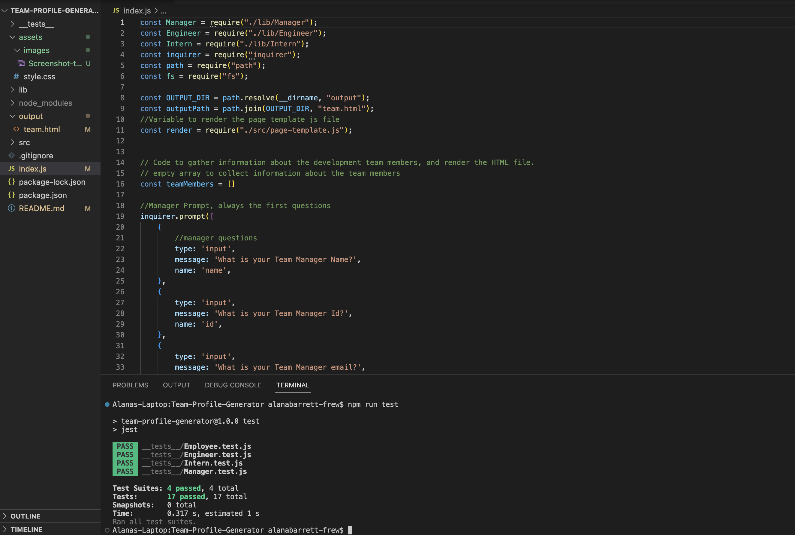

# Team-Profile-Generator
[](https://opensource.org/licenses/MIT)

## Table of Contents

* [Technology Used](#TechnolgyUsed)
* [Description](#Description)
* [User Story](#UserStory)
* [Installation](#Installation)
* [Usage](#Usage)
* [Tests](#Tests)
* [Credits](#Credits)
* [License](#License)
* [Questions](#Questions)

## Technology Used


## Description

Using Object-Orientated Programming, this application converts starter code into a working Node.js command-line application. It takes information about employees on a software engineering team, then generates an HTML webpage that displays summaries for each person. Every part of the code passes each provided test using jest.

:point_right: [Link to Github Repo](https://github.com/AlanaBF/Team-Profile-Generator) :point_left:

## User Story

```
As a manager or a user I want to generate a webpage that displays my team's basic info so that I or a user has quick access to their emails and GitHub profiles.
```

## Installation

In order to run this application, run the following in the command line:

```bash
npm install
```

## Usage

Run the following in the command line

```bash
node index.js
```

* A command-line application that accepts accepts user input using the provided starter code.
  * Classes for each team member provided and exported. The tests for these classes (in the `_tests_` directory) ALL pass.
    * The first class is an `Employee` parent class with the following properties and methods:
      * `name`
      * `id`
      * `email`
      * `getName()`
      * `getId()`
      * `getEmail()`
      * `getRole()`&mdash;returns `'Employee'`
    * The other three classes extend `Employee`.
    * In addition to `Employee`'s properties and methods, `Manager` also has the following:
      * `officeNumber`
      * `getRole()`&mdash;overridden to return `'Manager'`
    * In addition to `Employee`'s properties and methods, `Engineer` also has the following:
      * `github`&mdash;GitHub username
      * `getGithub()`
      * `getRole()`&mdash;overridden to return `'Engineer'`
    * In addition to `Employee`'s properties and methods, `Intern` also has the following:
      * `school`
      * `getSchool()`
      * `getRole()`&mdash;overridden to return `'Intern'`
  * Code written in `index.js` that uses inquirer to gather information about the development team members and creates objects for each team member using the correct classes as blueprints.
    * When a user starts the application then they are prompted to enter the **team manager**’s:
      * Name
      * Employee ID
      * Email address
      * Office number
    * When a user enters those requirements then the user is presented with a menu with the option to:
      * Add an engineer
      * Add an intern
      * Finish building the team
    * When a user selects the **engineer** option then a user is prompted to enter the following and then the user is taken back to the menu:
      * Engineer's Name
      * ID
      * Email
      * GitHub username
    * When a user selects the intern option then a user is prompted to enter the following and then the user is taken back to the menu:
      * Intern’s name
      * ID
      * Email
      * School
    * When a user decides to finish building their team then they exit the application, and the HTML is generated.
  * Call the `render` function (provided for you) and pass in an array containing all employee objects;
    * The `render` function will generate and return a block of HTML including templated divs for each employee!
  * Create an HTML file using the HTML returned from the `render` function.
    * Write it to a file named `team.html` in the `output` folder.
    * You can use the provided variable `outputPath` to target this location.


## Tests

This application uses Jest as a testing framework. To run the tests, open the console and type:

```
npm run test
```

Jest will carry out the tests and write the results to the console.



## Credits

Created by Alana Barrett-Frew using code provided by Dan Mueller and course material as reference materials.

## License

*This project is licensed under* [MIT](https://choosealicense.com/licenses/mit/)

## Questions

*Contact me if you have any questions or need to report a problem. Alternatively open an issue.*

Find me on GitHub: [AlanaBF](https://github.com/AlanaBF)

Email: [alanabarrett-frew@hotmail.com](mailto:alanabarrett-frew@hotmail.com)
---
